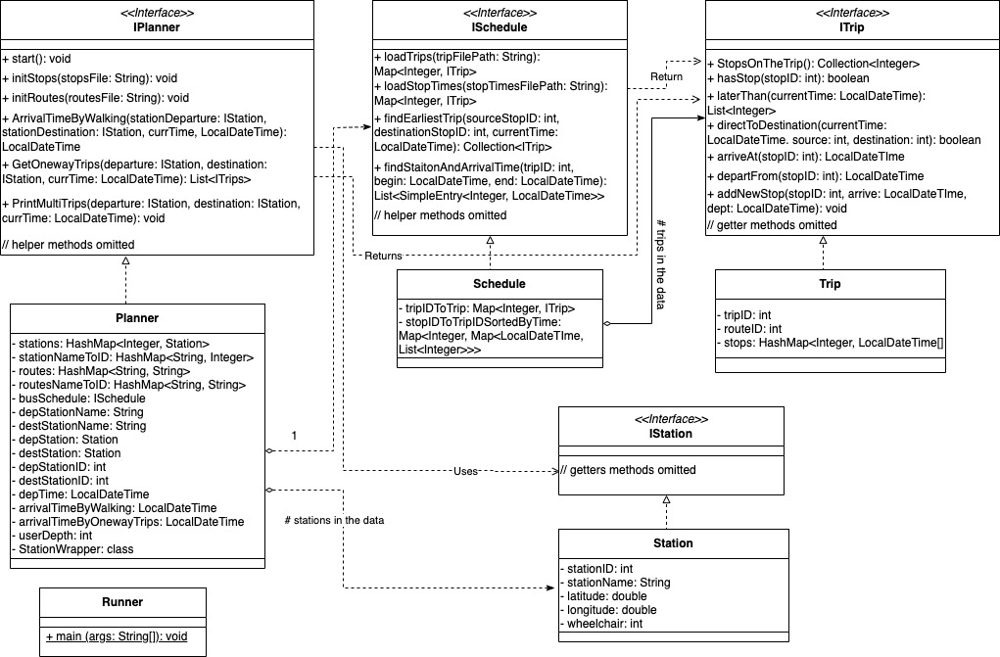

# Philadelphia Bus Navigation Planner 

Slides: [link](https://docs.google.com/presentation/d/11El9NlnaqoGMNOjZnDJregU51LiV9mvKoBlmuXgXDp4/edit?usp=sharing)

Video Demo: [link](https://youtu.be/NZqxZPY3Wao)

## Team Member

Zheyi Chen, Ziyi He, Justin Ng, Liujia Wang

## Description

This is a Philadelphia-based navigation planner that recommends user the shortest time route between two locations. The user is asked to input a trip start time, a departure station, a destination station, and maximum number of bus transfer and is recommended a walking or a bus route option.

## Key Simplifying Assumptions

### User Input

- Point of departures and destinations are all bus stations.
- User knows the exact names of the departure and destination station.
 
### Walking Option

- For any pair of (source, destination), we offer a walking option where user walks all the way from the source to destination, so in any situation, there should be at least one feasible solution.
- Assume walking speed is 80 meters/min.
- Distance between two stations is calculated as Euclidean distance.

## Data Collection
Public transportation schedule datasets are downloaded from the [SEPTA website](https://www3.septa.org/). In particular, four tables are used to extract route and schedule information: *stop_times*, *stops*, *trips*, and *routes*. 

## Class Diagram

     

## Next Steps

- Incorporate Google Map API to extract  more accurate geolocation information
- Build a GUI so that users can type in their search and interact with the map
- Allow walking between close stations and locate nearest station given any location
- Incorporate other means of transportation, such as rail, bike, taxi, car, etc.
- Consider other metrics when recommending the best route, such as trip fare 